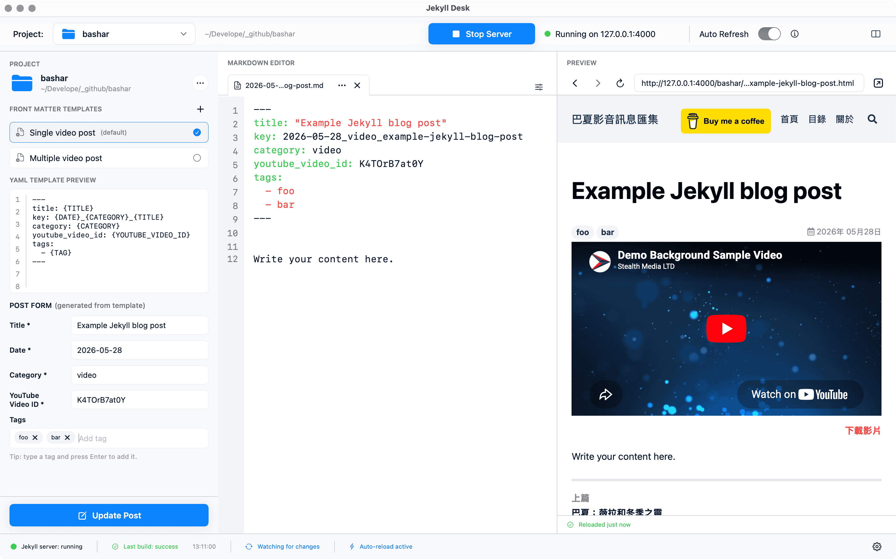

# Jekyll Desk

macOS app for writing, managing, and previewing Jekyll posts from a desktop editor. Add a Jekyll project, create posts from front matter templates, edit Markdown, run `jekyll serve`, and preview the generated page in the same window.



## Features

- Adds local Jekyll projects from a folder picker
- Detects Jekyll-style projects with `_config.yml` or `_posts`
- Creates Markdown posts with generated YAML front matter
- Includes a default blog post template with title, date, category, tags, and description fields
- Supports custom front matter templates per project
- Saves posts into the configured `_posts` folder
- Scans Markdown files from the configured posts and drafts folders
- Opens existing scanned posts in the editor
- Autosaves Markdown and front matter changes after a short debounce
- Runs the configured Jekyll serve command from the selected project
- Forces preview serving on `127.0.0.1:4000`
- Shows Jekyll build and serve status in the toolbar and status bar
- Reloads the WebView preview after successful saves and builds
- Supports editor-only, preview-only, and editor plus preview layouts
- Provides editor settings for word wrap, line numbers, font size, and tab size

## Planned Features

- Browse a project's drafts and posts folders directly
- Edit and preview already-created files from the project browser

## Requirements

- macOS 15.5+
- Xcode 16+
- Swift 5
- A local Jekyll project with its Ruby dependencies installed

The app has no third-party Swift package dependencies. Jekyll itself must be available to the selected project through the configured serve command, which defaults to `bundle exec jekyll serve`.

## Download

Download the latest release from:

[https://github.com/zenkarsha/jekyll-desk/releases](https://github.com/zenkarsha/jekyll-desk/releases)

After installing the app, macOS may block it on first launch. If that happens, go to `System Settings > Privacy & Security` and click `Open Anyway`.

## Run

Using Xcode:

1. Open `Jekyll Desk/Jekyll Desk.xcodeproj`
2. Select the `Jekyll Desk` scheme
3. Run the app

Using the command line:

```bash
xcodebuild \
  -project "Jekyll Desk/Jekyll Desk.xcodeproj" \
  -scheme "Jekyll Desk" \
  -destination "platform=macOS" \
  build
```

## Test

```bash
xcodebuild \
  test \
  -project "Jekyll Desk/Jekyll Desk.xcodeproj" \
  -scheme "Jekyll Desk" \
  -destination "platform=macOS" \
  -derivedDataPath ".deriveddata/test"
```

## Local Install

The repo includes an install script that will:

- Build the app with the `Release` configuration
- Stop the currently running `Jekyll Desk` process if needed
- Copy the `.app` bundle to `/Applications`

Command:

```bash
./scripts/install_local.sh
```

To open the app after installing:

```bash
OPEN_AFTER_INSTALL=1 ./scripts/install_local.sh
```

## Project Structure

```text
.
├── README.md
├── screenshot.png
├── Jekyll Desk/
│   ├── Jekyll Desk.xcodeproj
│   ├── Jekyll Desk/
│   │   ├── Jekyll_DeskApp.swift
│   │   ├── Services/
│   │   │   ├── FrontMatterGenerator.swift
│   │   │   ├── FrontMatterParser.swift
│   │   │   ├── JekyllBuildService.swift
│   │   │   ├── JekyllServeService.swift
│   │   │   ├── MarkdownFileService.swift
│   │   │   ├── ProjectScanner.swift
│   │   │   └── SlugService.swift
│   │   ├── ViewModels/
│   │   │   ├── AppViewModel.swift
│   │   │   ├── EditorViewModel.swift
│   │   │   ├── JekyllServerViewModel.swift
│   │   │   └── ProjectViewModel.swift
│   │   ├── Views/
│   │   │   ├── MainWindowView.swift
│   │   │   ├── MarkdownEditorView.swift
│   │   │   ├── PreviewWebView.swift
│   │   │   ├── ProjectSidebarView.swift
│   │   │   ├── StatusBarView.swift
│   │   │   └── TopToolbarView.swift
│   │   ├── Models/
│   │   ├── Jekyll_Desk.entitlements
│   │   └── Assets.xcassets/
│   ├── Jekyll DeskTests/
│   └── Jekyll DeskUITests/
├── Jekyll Desk-icon/
├── dist/
└── scripts/
```

## License

MIT License
